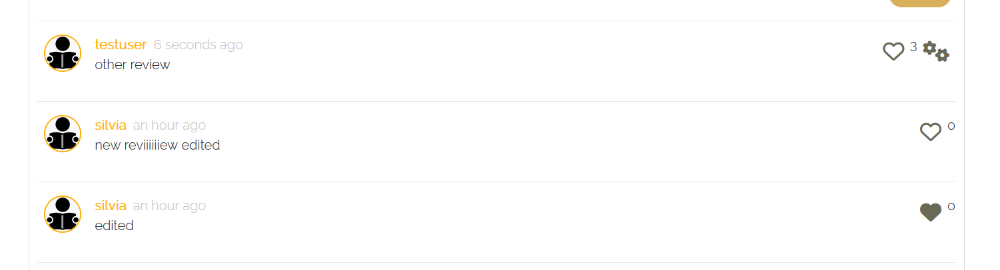

# Readers's angle:

'Reader's angle' website project had been created as a final portfolio project for Code Institute full stack course.

For the frontend part of the project, I chose to use React to develop a dynamic and engaging user interface. My goal was to provide readers with a seamless and intuitive experience that allows them to explore, engage, and connect with the vibrant literary community.

Using React, I crafted various components that work together harmoniously to create an interactive and visually appealing interface. I wanted readers to feel immersed in the world of books and easily connect with other book enthusiasts. By utilizing React's capabilities, I aimed to deliver a user-friendly interface that makes it effortless for readers to navigate, discover new books, and engage with the content.

It was important to me to provide a user experience that feels smooth, natural, and enjoyable, allowing readers to fully immerse themselves in the website and connect with fellow book lovers.

## Project Goals:

- Provide an intuitive and user-friendly platform for readers to share their thoughts, opinions, and recommendations on books.

- Create a vibrant literary community where users can engage with each other's posts, fostering discussions and interactions around various books.

- Implement comprehensive CRUD functionality to allow users complete control over their interactions, including creating, reading, updating, and deleting their posts.

- Enable users to leave detailed reviews for specific books, offering valuable feedback and insights to other readers.

- Facilitate a personalized and meaningful reading experience by allowing users to express their liking for posts.

- Incorporate social features, such as the ability to like/unlike posts and reviews, to encourage engagement and interaction among users.

- Allow users to explore other users' profiles to discover their book recommendations and connect with like-minded readers.

- Lay a solid foundation for future development, enabling the addition of new features and enhancements to further enhance the reading and community experience on the website. Such as
  - 1. let users indicate their reading intentions (whether they have read a book or plan to read it).
  - 2. let users follow/unfollow a post so to stay engaged with the post discussion.

## Agile development:

I adopted an agile development approach to keep track of my progress effectively. GitHub issues and projects played a crucial role in documenting and organizing the development process.

For each user story, I created a GitHub issue and applied appropriate labels to categorize them. These user stories represented specific features or functionalities that needed to be implemented. To manage the overall backlog, I created a GitHub milestone to gather all the user stories initially.

To ensure a structured development process, I divided my work into iterations, each lasting for around 7 working days. However, the actual duration of each iteration varied as I needed to accommodate my work and other commitments.

To visualize and organize my tasks, I created a separate GitHub project board for each iteration. As I started working on an iteration, I moved the relevant user stories from the product backlog into the project board associated with that specific iteration.

To track my progress effectively, I utilized a project kanban board within GitHub. This board allowed me to visualize the status of each user story. I moved them between columns like 'Todo', 'In Progress', and 'Done' based on their current stage of completion.

By adopting these agile development practices and utilizing GitHub issues, projects, and kanban boards, I could manage my work efficiently. This approach helped me stay organized, prioritize tasks, and ensure timely completion for most of them! Please note that two features were left to implement from the following user stories.

#### Features left to implement:

- Mark a post: As a logged-in user, I have the ability to mark a post as 'Read' or 'Will read' so that i can keep track of my readings.

- Follow a post: As a logged-in user, I can follow a post so that i stay enganged with discussion/reviews developments.

Since this functionality were not implemented initially, other user stories such as filtering posts based on the reading status or generating recommendations based on the most followed posts, are still pending.
To address this, I have chosen to preserve the original user stories in this documentation for future reference, allowing me to revisit and complete them at a more opportune time. However, I have removed these particular stories from the current project to accurately reflect the progress made and appropriately close the associated milestones.

# Sprints, Epics and User Stories:

## Sprint1 - Navigation & Authentication:

During this sprint, the focus will be on implementing the navigation system and user authentication functionality within the project.

### Seamless Navigation and Secure Authentication:

This epic focuses on providing users with a seamless navigation experience throughout the website, along with robust authentication functionalities to ensure secure access to user accounts and features. It includes the implementation of a persistent menu bar, efficient page routing without full page reloads, user sign-up and sign-in capabilities, logged-in status indication, token refreshing for uninterrupted sessions, conditional rendering based on login status, and the display of user avatars for identification purposes.

#### Navigation:

As a user, I want to see a menu bar on every page so that I can easily move around different parts of the website without any difficulty.

#### Routing:

As a user, I want to navigate through pages quickly without the need for the entire page to reload, so that I can smoothly view the content without any interruptions.

#### Authentication - Sign up:

As a user, I want to create a new account so that I can access all the features that are available to registered users.

#### Authentication - Sign in:

As a user, I want to log in to the application so that I can access the functionalities and features that are only available to logged-in users.

#### Authentication - Logged in Status:

As a user, I want to know if I am currently logged in or not, so that I can take appropriate actions like logging in if needed.

#### Authentication - Refreshing access tokens:

As a user, I want to stay logged in until I decide to log out, so that I can have a seamless user experience without constantly needing to re-authenticate.

#### Navigation - Conditional rendering:

As a user who is not logged in, I want to see options for signing in and signing up, so that I can easily create a new account or access my existing account.

#### Avatar:

As a user, I want to see profile pictures or avatars of other users, so that I can easily identify and recognize different users within the application.

## Sprint2 - Posts & Posts functionality:

During this sprint, the focus will be on implementing the posts CRUD functionalities, and also some extra functionalities such as liking or for future release: following a post.

### Adding & Liking, Marking and Following Posts:

This epic focuses on enhancing user engagement and interaction within the application by allowing logged-in users to create and share their own posts, view detailed information about individual posts, express appreciation by liking and following posts that they find interesting, and mark posts as 'Read' or 'Will Read'.

#### Create posts:

As a user who is logged in, I can easily create and share my own posts with others, allowing me to showcase my content to the world.

#### View a post:

As a user, I can access and explore the specific details of an individual post, enabling me to gather more information and insights about it.

#### Like a post:

As a logged-in user, I have the ability to express my appreciation and support for posts that catch my interest by liking them, indicating my positive response to the content.

#### Mark a post: (to be implemented)

As a logged-in user, I have the ability to mark a post as 'Read' or 'Will read' so that i can keep track of my readings

#### Follow a post: (to be implemented)

As a logged-in user, I can follow a post so that i stay enganged with discussion/reviews development

## Sprint3 - Posts:

This sprint will focus on improving how posts are shown to users. There will also be added a search bar to help users find specific posts quickly. Additionally, interactive features like liking, commenting, etc will be introduced to make the platform more engaging and fun to use.

### The posts page:

This epic focuses on enhancing the user experience on the Posts page by providing features such as viewing the most recent posts, searching for posts and user profiles, accessing liked posts, viewing posts marked as read or will read, and implementing infinite scroll functionality to enable seamless browsing without the need for manual page navigation.

#### View most recent posts:

As a user, I can easily access and browse through the latest posts, arranged in order of their creation, ensuring that I stay updated with the most recent content.

#### Search for posts:

As a user, I have the capability to search for posts and user profiles using specific keywords, enabling me to find the posts and users that align with my interests.

#### View liked posts:

As a logged-in user, I can conveniently access and view the posts that I have liked, allowing me to revisit and enjoy the content that resonates with me the most.

#### View posts marked as Read or Will Read: (to be implemented)

As a logged-in user, I can explore and see the posts i've marked as read or will read, ensuring that I stay organized and up-to-date with my reading preferences.

#### Infinite scroll:

As a user, I can effortlessly continue scrolling through the posts on the website, as new posts are automatically loaded for me, eliminating the need to manually click on "next page" or similar buttons.

## Sprint4 - Post page:

This sprint will focus on implementing crud functionalities for the reviews/comment of the posts, and extra funtionalities such as liking reviews.

### The post page:

This epic focuses on enriching the user experience on the Post page by providing features such as accessing the post page to read reviews and discussions, allowing the owner of a post to edit the post's title and description, enabling logged-in users to create and contribute reviews, displaying the review date to provide context, allowing users to like reviews, view reviews from other users, and providing the functionality for the owner of a review to delete or edit their own review.

#### Post page:

As a user, I can access the post page, enabling me to read the reviews and discussions about the post.

#### Edit and delete post:

As the owner of a post, I have the ability to delete my post and/or modify the title and description/content of my post. This feature enables me to make corrections or updates to my post even after it has been published.

#### Popular posts:

As a logged-in user, I can see the most popular posts so that I can stay engaged with relevant discussion/reviews and see what the community likes the most

#### Create a review:

As a logged-in user, I can contribute by adding reviews to a post. This functionality allows me to share my thoughts and opinions about the post, providing feedback and insights.

#### Review date:

As a user, I can see the time elapsed since a review was made. This information helps me determine the age of a review and provides context to its relevance within the discussion.

#### View reviews:

As a user, I can read the reviews posted by other users on a particular post. This allows me to gain insights into the perspectives and opinions shared by the community.

#### Like reviews:

As a logged-in user, I have the ability to express my appreciation and support for reviews that catch my interest by liking them, indicating my positive response to the content.

#### Delete reviews:

As the owner of a review, I have the authority to delete my own review. This control empowers me to manage the removal of my review from the application as needed.

#### Edit a review:

As the owner of a review, I can edit the content of my review. This functionality allows me to modify or update the information within my existing review.

## Sprint5 - User Profile:

This sprint will focus on the creation of an interface for the user profile,with crud functionalities to allow users to edit their profiles, and with a focus on showing user preferences.

### The Profile Page:

This epic focuses on enhancing the user experience on the Profile page by providing features such as viewing other users' profiles, accessing the list of most followed posts, displaying user statistics, allowing users to follow or unfollow specific posts, exploring all posts by a specific user, enabling the editing of user profiles including profile picture and bio, and providing the functionality to update the username and password for logged-in users.

#### Profile page:

As a user, I can view other users' profiles to see their posts and learn more about them.

#### Most followed post: (to be implemented)

As a user, I can view a list of the most followed posts, providing me with insights into which posts are popular among the community.

#### User profile - user stats:

As a user, I can view statistics about a specific user, such as their bio, number of posts, and other relevant information, allowing me to get to know them better.

#### View all posts by a specific user:

As a user, I can explore all the posts created by a specific user, enabling me to catch up on their latest posts or decide if I want to engage with their content.

#### Edit profile:

As a logged-in user, I have the ability to edit my profile, which includes changing my profile picture and updating my bio.

#### Update username and password:

As a logged-in user, I can update my username and password, allowing me to modify my display name and ensure the security of my account.

## Project Planning:

### Wireframes:

In order to gain a clearer visual representation of the layout and structure for Reader's angle, I utilized Balsamiq to create low-fidelity wireframes. These rough sketches provided a basic outline for the website's design and functionality.

#### Sign in/up forms:

---

#### Homepage:

---

#### Share book form:

---

#### Post page:

---

#### Profile page:

---

#### Edit profile form:

### Schema:

The schema and data models are documented in the read me file of Reader's angle backend [Reader's angle Backend](https://github.com/SilviaSaverino/Reader-s-angle-Back-end)

## Design:

I have adopted a minimalistic and intuitive design approach, prioritizing simplicity and clarity. To create a warm and inviting atmosphere, I have carefully selected warm colors, including various shades of orange. By incorporating these elements, I aim to deliver a visually appealing and user-friendly experience that seamlessly blends functionality and aesthetics

### Colours:
In my design, I have carefully chosen colors to highlight different sections of the website and create an appealing and comforting user experience. Below the colors I have used and their purpose:

#### Text Links: 
I have used a shade of dark gray (#555555) for regular text links. These links smoothly transition to a warm orange color (#be8d22) on hover, creating an engaging effect. Additionally, icons within the links transition to a brighter orange shade (#ffad01), adding a touch of vibrancy.

#### Icons: 
The icons are styled in a soft olive color (#696957) and have a font size of 1.6rem. They are subtly highlighted by providing a slight padding and vertical alignment, ensuring they are visually appealing and easily recognizable.

#### Content Background: 
The background color for the content section is a clean white (#ffffff). This choice enhances readability and provides a clean and organized appearance. The content section is further accentuated by a 10px padding and a subtle border with a light gray color (#dadadf).

#### Buttons: 
The buttons have a distinctive appearance with a background color of deep orange (#c38602) and white text. On hover, they transition to a brighter orange shade (#ffad01) with black text. This color combination creates a visually pleasing contrast and encourages user interaction.

#### Like Icons: 
The like icons are represented by a charming coral color (#ff9254). When hovered over, they transition to a slightly brighter orange shade (#ffad01) or revert to the original coral color, providing visual feedback and enhancing the interactive element.

#### Section Headings: 
Each section heading, represented by h5 tags, features a soothing beige color (#fcf8ed) as its background. This creates a visual separation between sections and adds a touch of elegance to the overall design.

By employing these carefully selected colors and styles, I aim to create a visually appealing, user-friendly, and comforting experience for users navigating through the website.

### Fonts:
In my project, I have chosen the "Raleway" font to enhance the typography and overall visual appeal, with a fallback option of Sans-serif. Those fonts are applied to the entire application.

The "Raleway" font I chose for the project is versatile and easy to read. It fits nicely with the overall design and makes everything look professional and attractive. Whether it's titles, paragraphs, or other text, this font adds a nice touch to the application's appearance.

## Features:

### Homepage:

### Sign In/Up forms:

### ShareBook form:

### Post page:

### Profile page:

### Liked page:

## Components and Re-use of compoments:

### Asset:

The Asset component is responsible for rendering an asset, such as an image or a spinner, along with an optional message. It receives the following props:

- spinner (boolean): If true, a spinner animation is displayed.
- src (string): The source URL of the image to be displayed.
- message (string): An optional message to be displayed below the asset.

This component is utilized throughout the project to display various assets, such as images and loading spinners, along with corresponding messages when needed.

### Avatar:

The Avatar component is used to display a user's profile avatar. It receives the following props:

- src (string): The source URL of the avatar image.
- height (number): The desired height of the avatar image.
- text (string): Optional text to be displayed next to the avatar image.

In the project, the Avatar component is used to represent user avatars in different sections, such as the navbar and profile pages.

### MoreDropdown:

The MoreDropdown component is a dropdown menu that provides additional options for user interaction. It receives two callback functions as props:

- handleEdit: Callback function to handle the edit action.
- handleDelete: Callback function to handle the delete action.

This component is utilized in sections where additional actions can be performed on items, such as editing or deleting posts.

### ProfileEditDropdown:

The ProfileEditDropdown component is a dropdown menu specifically used for profile editing options. It receives the user's profile ID as a prop and utilizes the useHistory hook from react-router for navigation.

This component is used in the profile page to provide editing options for the user's profile, including editing the profile information, changing the username, and changing the password.
NavBar

### The NavBar component:

This component represents the navigation bar of the website. It includes the project logo, navigation links, and user-specific icons based on the user's authentication state. It utilizes various components, including Avatar, MoreDropdown, and NavLink from react-router.

The NavBar component is a key part of the website's layout and provides navigation functionality, user authentication options, and a responsive design for different screen sizes.

These components play crucial roles in different sections of the project, contributing to the overall functionality, visual appeal, and user experience of the website.

## Hooks and custom hooks:

### useClickOutsideToggle:

The useClickOutsideToggle hook is used to handle toggling a state variable (expanded) based on clicks that occur outside a specified element. It returns an object with the following properties:

- expanded (boolean): The state variable that tracks the toggle status.
- setExpanded (function): A function to update the expanded state variable.
- ref (object): A reference to the specified element.

This hook is utilized to control the toggling behavior of certain components or menus when a click event occurs outside of them. It enhances user interaction by allowing the components to be collapsed or hidden when clicking outside their boundaries.

### useRedirect:

The useRedirect hook is responsible for redirecting users based on their authentication status. It takes the userAuthStatus as an argument and uses the useHistory hook from react-router for navigation.

This hook is used to redirect users to different routes depending on their authentication status. If the user is logged in (userAuthStatus === "loggedIn"), they are redirected to the home page ("/"), and if they are logged out (userAuthStatus === "loggedOut"), they are also redirected to the home page ("/"). It ensures proper navigation and user experience based on their authentication status.

### useState:

The useState hook allows you to add state to functional components. By calling this hook and passing an initial value, it returns an array with two elements: the current state value and a function to update that value. You can use this function to modify the state value, triggering a re-render of the component. This hook is useful for managing and updating dynamic data within your components.

### useEffect:

The useEffect hook is used to perform side effects in functional components. It accepts a callback function and an optional array of dependencies. The callback function will be executed after the component has rendered, and it can handle tasks like data fetching, subscriptions, or manually interacting with the DOM. The dependencies array allows you to specify values that the effect depends on. If any of these values change, the effect will re-run. This hook is essential for handling side effects and managing the lifecycle of functional components.

## Crud functionalities:

## Frameworks, libraries and dependencies:

### axios:

I chose axios to simplify making HTTP requests to my REST API. It offers a simple and consistent API for sending and receiving data from servers, eliminating the need for manual configuration of HTTP headers and handling complex request/response logic. This streamlined approach improves my development efficiency and reduces the likelihood of errors.

### jwt-decode:

I included the jwt-decode library to simplify the decoding of JSON Web Tokens (JWT). It provides an easy-to-use interface for extracting information from JWTs, such as the user's identity and any additional claims encoded within the token. By using this library, I can easily access the necessary information stored in JWTs, enabling secure authentication and authorization within my application.

### react-bootstrap:

I chose the react-bootstrap library to utilize Bootstrap components as React components. It provides a set of pre-built React components that are compatible with Bootstrap's styling and functionality. This library streamlines the process of incorporating Bootstrap components into my React application, allowing me to create responsive and visually appealing user interfaces with minimal effort.

### react-dom:

I included React DOM, as it is a fundamental package that enables rendering React components into the browser's DOM. It provides methods for efficiently updating the DOM when React components change. This library is essential for my React application as it facilitates the seamless integration of React components into the browser environment.

### react-router-dom:

I chose the react-router-dom library for handling routing in my React application. It enables me to define different routes and associate them with specific components, allowing for the rendering of different views based on the current URL. This library simplifies the navigation and organization of multiple pages or views within a single-page application, enhancing user navigation and the overall user experience.

### react-infinite-scroll-component:

I included the react-infinite-scroll-component library to implement infinite scrolling functionality in my React application. It allows me to load and display additional content as the user scrolls down the page, dynamically fetching and rendering data as needed. This improves the user experience by providing a smooth and seamless browsing experience, particularly when dealing with large sets of data or content.

## Testing:

### Manual testing:

To ensure the proper functioning and performance of our website, i have conducted a series of manual testing procedures. These tests were carried out to validate various aspects of the site and ensure its smooth operation. The following are the key manual testing activities that were performed:

## Validators:

## Bugs and fixes:

An unresolved issue remains unresolved because even the tutors were uncertain about the cause of the issue.

The problem involves the profile data being replaced by that of the currently logged-in user. Essentially, if a logged-in user were to refresh the profile page or manually change the URL ID from Silvia's profile (ID 1) to Ellie's profile (ID 30), without clicking/ choosing from the profile avatar but by modifying the URL directly, the displayed information would be the bio and other details of the logged-in user or the profile 'test', but the posts would belong to Ellie as per normal behaviour.

I confirmed this issue by using console.log statements, which showed that the profiles were loading correctly in the console. It would indicate that the profile belongs to Ellie with ID 30, but a different profile would still be displayed.

I encountered another bug that needed fixing, which involved the incrementation of the reviews count. When I investigated the issue further, I discovered that instead of incrementing the review count for the post, it was incrementing the review count for the user who added the like. The root of the problem was in the backend code.

To resolve this issue, I made the necessary changes to the backend by following these steps:

- 1. Corrected the queryset of my reviewlike views by removing the 'owner' part from it.

- 2. Updated the related name in my reviewLike model from 'likes' to 'reviewlike'.

## Deployment:

## Credits:

To complete this website, I relied on various external sources for guidance and resources. Here'sa list of some of them and how I utilized them:

- Moments Walkthrough Project from Code Institute: I referred to the Moments walkthrough project from Code Institute as a valuable resource. It provided a practical example and guidance on implementing certain features or functionalities that I wanted to incorporate into my website. It helped me understand the concepts and best practices related to building a similar project.

- Stack Overflow: Stack Overflow is a popular online community where developers ask questions and receive answers from the programming community. Whenever I encountered a specific issue or bug during the development process, I referred to Stack Overflow to find potential solutions or insights from experienced developers who may have encountered similar problems.

- React Documentation: React's official documentation served as a crucial reference for understanding React's core concepts, components, hooks, and other APIs. It provided detailed explanations, examples, and usage guidelines that helped me build React components and implement React-specific functionality effectively.

- React Bootstrap Documentation: To leverage the capabilities of React Bootstrap, I referred to the official documentation of React Bootstrap. It provided documentation and examples for utilizing the pre-built React components and styling options provided by React Bootstrap. This documentation helped me understand how to integrate and customize Bootstrap components within my React application.

- Pinterest and Amazon Websites: For images related to books and posts on my website, I obtained them from sources like Pinterest and Amazon. These platforms often provide a wide range of visual content related to various topics, including books and products. By using images from these sources, I was able to enhance the visual appeal and content representation on my website.

By utilizing these and other external sources, I could leverage existing knowledge, community support, and resources to develop my website effectively. It allowed me to take advantage of best practices, learn from others' experiences, and incorporate visually appealing content into my project.

## Acknowledgements:
